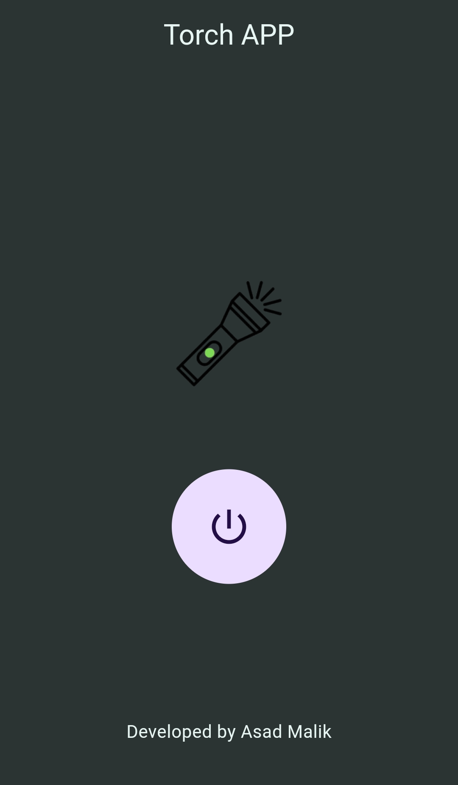

# TorchUP App

TorchUP is a lightweight and user-friendly app that turns your mobile device into a flashlight. Whether you’re at home during a power outage or looking for something in the dark, TorchUP provides a simple and reliable tool with minimal resources and fast access.


## Features ✨

* 💡 Flashlight On/Off: Use your phone’s LED flashlight by tapping a single button.
* 🎨 Dark Mode Support: Enjoy a visually comfortable experience with built-in dark mode.
* 🎛️ Minimalist UI: Simple and effective design for ease of use.
* 🔋 Battery Efficient: Designed to consume minimal power while active.
* 📲 Quick Access: Easily toggle the flashlight without needing to unlock the phone (planned feature).
## Screenshots 📷



## Prerequisites 🛠️

* Flutter SDK: Make sure you have Flutter installed. Follow Flutter installation instructions if needed.

* Android/iOS Device or Emulator: A real device is recommended to test flashlight functionality.
## Getting Started 🚀

1. Clone the Repository:

```
git clone https://github.com/Malikasad74/TorchUP.git
cd torchup

```

2. Install Dependencies:

```
flutter pub get

```

3. Run the App:

```
flutter run

```

## Usage 📖

1. Open the TorchUP app.
2. Tap the flashlight button to turn the flashlight on or off.
3. Enjoy a simple and effective light source.
## Dependencies 📦

* torch_controller: For controlling the device’s flashlight.
* permission_handler: Manages camera and flashlight permissions.
## Upcoming Features 🔮

 * Widget for quick access from the home screen.
 * SOS signal mode for emergencies.
 * Strobe light feature with adjustable speed.

## Need a quick light? Tap the image below to download the APK and turn your phone into an instant flashlight! Brighten up your world in seconds!

<a href="Torch APP.apk">
    
</a>
